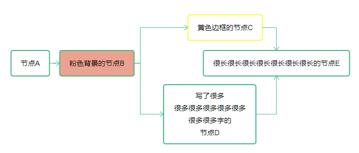
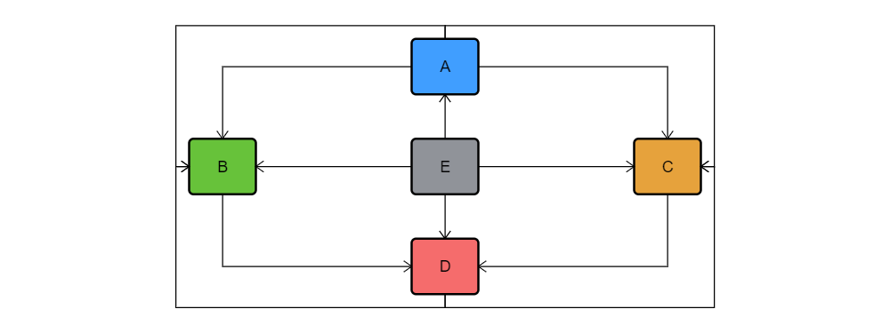

# Paroflow

Paroflow is a simple flow-chart builder which work with `D3.js`.

```
# Project setup
npm install

# Run demo
npm run serve

# Output .js and .d.ts file
npm run build
```

# Demo

### Informal:



### Pretty One:



# Usage

### First, you need set a `svg` Element in your page.

```html
<svg id="paroflow"></svg>
```

### Create an instance of `FlowChart`.

You must pass a valid selector which can find your `svg` element to locate render position. In this case you can code like this:

```javascript
const chart = new FlowChart('#paroflow')
```

You can also privide some global options like:

```javascript
const options = {
  width: 400,
  height: 300,
  fontSize: 16
}
const chart = new FlowChart('#paroflow', options)
```

Full options see: `FlowChartInitialOptions` in [Declaration file](dist/chart.d.ts)

### Add nodes and link them

All public method of `FlowChart` instance is designed to support chained calls:

```javascript
chart
  .addNode('node1', 200, 50, 'Hello')
  .addNode('node2', 200, 150, 'ParroT')
  .addEdge('node1', 'node2')
```

You can provide options to `Node` and `Edge` too, note that the options you privide here will overwrite global options:

```javascript
chart
  .addNode('node1', 200, 50, 'Hello', { fontSize: 12 })
  .addNode('node2', 200, 150, 'ParroT', { fontColor: '#47b785' })
  .addEdge('node1', 'node2', { width: 2 })
```

Same as before, you can find full options of `FlowChartNodeOptions` and `FlowChartEdgeOptions` in [Declaration file](dist/chart.d.ts)

### Render!

Just call `render()` at `FlowChart` instance simply:

```javascript
chart.render()
```

Of course, you can call `render()` chained.

```javascript
chart
  .addNode(...)
  .addEdge(...)
  .render()
```
